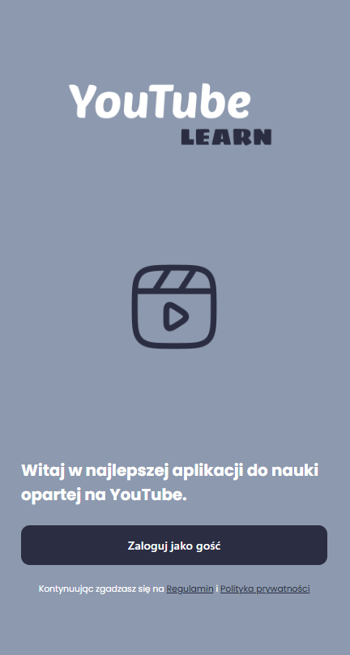
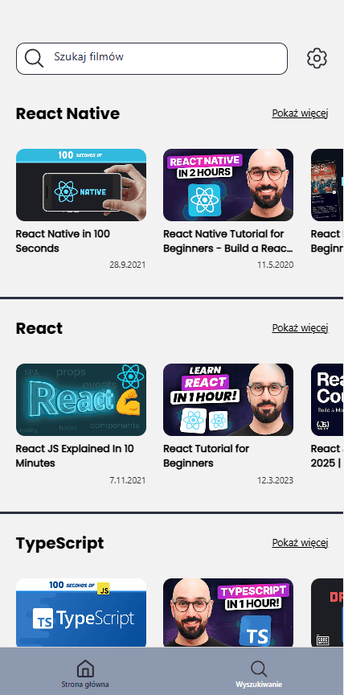
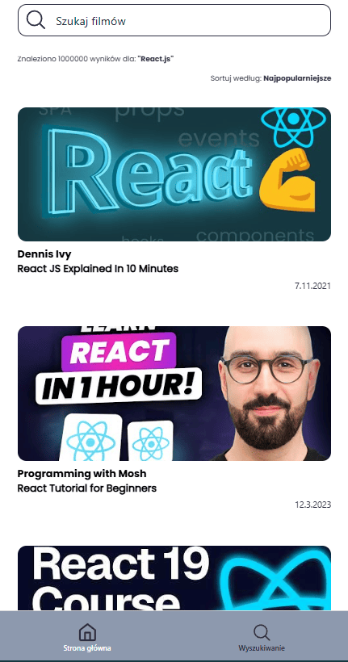
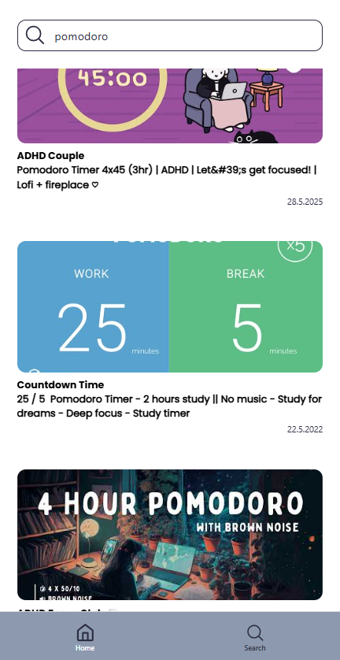
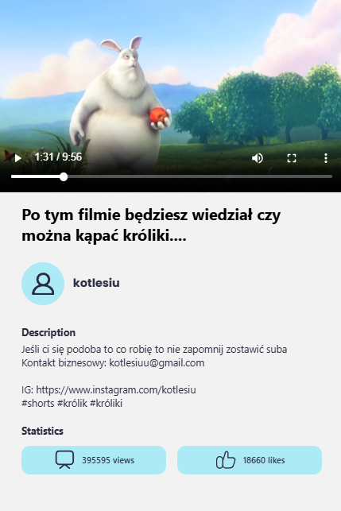

# YouTube Learn App

Aplikacja mobilna stworzona w React Native z Expo, która służy jako centrum wiedzy dla Junior React Native Developerów. Aplikacja została zrealizowana jako zadanie rekrutacyjne w przeciągu 72 godzin, a później była udoskonalana na podstawie otrzymanych feedbacków.

## 📱 O Projekcie

YouTube Learn App to aplikacja do przeglądania i zarządzania filmami edukacyjnymi z YouTube, podzielonymi na kategorie tematyczne: React Native, React, TypeScript i JavaScript. Aplikacja wykorzystuje YouTube Data API do pobierania aktualnych treści edukacyjnych.

## ✨ Główne Funkcjonalności


- **Ekran główny** z podziałem na cztery kategorie: React Native, React, TypeScript, JavaScript
- **Poziome przewijanie list** z opcją "Show more" przekierowującą do ekranu wyszukiwania
- **Wyszukiwarka wideo** z live search i debounce (500ms)
- **Ekran szczegółów wideo** z odtwarzaczem wideo i opisem
- **Odtwarzacz wideo** obsługujący tryb zminiaturyzowany i pełnoekranowy
- Sortowanie wyników wyszukiwania

## ✨ Widoki

### Widok Startowy



### Widok główny



### Widok kategorii



### Widok wyszukiwania



### Widok szczegółowy wideo




## 🛠️ Technologie

- **React Native** - framework do tworzenia aplikacji mobilnych
- **Expo** - platforma ułatwiająca development i deployment
- **TypeScript** - typowanie statyczne dla JavaScript
- **React Query** - zarządzanie stanem asynchronicznym i cache'owaniem danych
- **Expo Video** - odtwarzacz wideo
- **YouTube Data API v3** - źródło danych o filmach
- **i18next / react-i18next** - internacjonalizacja (PL/EN)
- **Zod** - walidacja danych z API

## 🚀 Uruchomienie Projektu

### Wymagania

- Node.js
- npm
- Expo CLI
- Aplikacja Expo Go na telefonie (opcjonalnie)

### Instalacja

1. Sklonuj repozytorium:

```bash
git clone https://github.com/kolodziejmateusz/youtube-learn-app.git
cd youtube-learn-app
```

2. Zainstaluj zależności:

```bash
npm install
```

3. Utwórz plik `.env` w głównym katalogu projektu:

```env
EXPO_PUBLIC_YOUTUBE_API_KEY=YOUR_API_KEY_HERE
```

> **Uwaga:** Aby uzyskać własny klucz API:
>
> 1. Przejdź do [Google Cloud Console](https://console.cloud.google.com/)
> 2. Utwórz nowy projekt
> 3. Włącz YouTube Data API v3
> 4. Wygeneruj klucz API w sekcji Credentials

4. Uruchom aplikację:

```bash
npx expo start
```

5. Wybierz platformę:
   - Naciśnij `w` aby uruchomić w przeglądarce
   - Zeskanuj kod QR aplikacją Expo Go aby uruchomić na telefonie

## 🎯 Kluczowe Implementacje

### Architektura

- **Separacja logiki od komponentów** - wydzielone serwisy API i custom hooks
- **Modularność** - małe, czytelne komponenty z pojedynczą odpowiedzialnością
- **TypeScript** - pełne typowanie w całej aplikacji
- **Theme system** - centralne zarządzanie stylami

### Zarządzanie Danymi

- **React Query** z `useInfiniteQuery` - infinite scroll, cache'owanie, retry
- **Zod** - walidacja struktury danych z YouTube API
- **Error handling** - szczegółowe komunikaty błędów w konsoli i dla użytkownika

### UX/UI

- **Live search** z debounce 500ms - wyszukiwanie bez zbędnych requestów
- **Loading states** - informacja o ładowaniu danych
- **Internacjonalizacja** - wsparcie dla języka polskiego i angielskiego

## 🔄 Historia Rozwoju

Aplikacja rozwijała się iteracyjnie na podstawie szczegółowego feedbacku technicznego:

### Iteracja 1 - Poprawki Podstawowe

- ✅ Wydzielenie logiki API do serwisów i hooków
- ✅ Dodanie walidacji API key
- ✅ Usunięcie inline styles
- ✅ Refaktor stylów - wprowadzenie theme.ts
- ✅ Poprawienie użycia key w listach
- ✅ Dodanie loading states
- ✅ Implementacja live search z debounce

### Iteracja 2 - Zaawansowane Funkcje

- ✅ Integracja React Query
- ✅ Infinite scroll z useInfiniteQuery
- ✅ Zamiana ScrollView na FlatList
- ✅ Walidacja danych z API (Zod)
- ✅ Internacjonalizacja (i18n) - PL/EN
- ✅ Lepsze komunikaty błędów dla użytkownika
- ✅ Fallback z danymi z JSON przy błędach API

## 🤝 Feedback i Rozwój

Projekt był rozwijany zgodnie z zasadami code review i professional development:

- Częste, znaczące commity
- Praca z feedbackiem technicznym
- Iteracyjne podejście do rozwoju funkcjonalności
- Dokumentacja zmian i decyzji architektonicznych


Projekt stworzony na potrzeby procesu rekrutacyjnego. Kod dostępny publicznie jako portfolio.

## 👤 Autor

**Mateusz Kołodziej**

- GitHub: [@kolodziejmateusz](https://github.com/kolodziejmateusz)
- Email: mateuszkolodziejti@gmail.com

---
